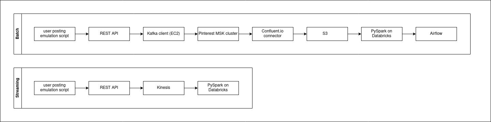

# Pinterest Data Pipeline

## Table of contents

1. [Description](#description)

1. [Installation instructions](#installation-instructions)
 
    - [Set up Kafka client](#set-up-kafka-client)

    - [Connect Pinterest MSK Cluster to an S3 Bucket](#connect-pinterest-msk-cluster-to-an-s3-bucket)

    - [Create REST API and integrate with Kafka client](#create-rest-api-and-integrate-with-kafka-client)

    - [Send data to Kafka via REST API](#send-data-to-kafka-via-rest-api)

    - [Read and analyse batch data in PySpark on Databricks](#read-and-analyse-batch-data-in-pyspark-on-databricks)

    - [Schedule batch analysis with Airflow](#schedule-batch-analysis-with-airflow)

    - [Integrate REST API with Kinesis](#integrate-rest-api-with-kinesis)

    - [Send data to Kinesis via REST API](#send-data-to-kinesis-via-rest-api)

    - [Read and analyse streaming data in PySpark on Databricks](#read-and-analyse-streaming-data-in-pyspark-on-databricks)
    

1. [Usage instructions](#usage-instructions)

1. [File structure](#file-structure)

1. [License information](#license-information)

## Description

This project is the Pinterest Data Pipeline for AiCore, aiming to replicate Pinterest's data analytics infrastructure using AWS Cloud tools.

There are two components to the workflow, as illustrated in the below diagram.



For both the batch and streaming worfklows, a Python script is executed to post a continuous stream of data to a REST API. 

For the batch worfklow, the REST API sends data to Kafka topics on an EC2 Kafka client machine. The Kafka cluster is connected to an S3 bucket via a Confluent.io connector; which means all all data sent to the Kafka topics is written to S3. The S3 bucket is mounted to DataBricks, which allows the data to be analysed in Databricks via PySpark. Finally, the Databricks analysis is scheduled via Airflow to run once per day.

For the streaming workflow, the REST API sends data to Kinesis. The streaming data is analysed in real time via PySpark, and written to delta tables on Databricks.

## Installation Instructions

To set up the Pinterest Data Pipeline, follow these steps:


### Set up Kafka client

1. Connect to an EC2 instance and install Kafka by running the following commands (be sure to install the same version of Kafka as the one the Pinterest MSK cluster is running on):

    ``` 
    $ sudo yum install java-1.8.0
    $ wget https://archive.apache.org/dist/kafka/2.8.1/kafka_2.12-2.8.1.tgz
    $ tar -xzf kafka_2.12-2.8.1.tgz
    ```

1. Configure IAM authentication. This will enable MSK (Managed Streaming for Kafka) to authenticate the client machine. Here's how:

    - Install the IAM MSK authentication package by running the following commands:
        
        ```
        $ cd kafka_2.12-2.8.1/libs
        $ wget https://github.com/aws/aws-msk-iam-auth/releases/download/v1.1.5/aws-msk-iam-auth-1.1.5-all.jar
        ```

    - Set the CLASSPATH environment variable to include the location of the package's .jar file. This ensures IAM authentication libraries will be accessible to the Kafka client:
        
        ```
        $ export CLASSPATH=/home/ec2-user/kafka_2.12-2.8.1/libs/aws-msk-iam-auth-1.1.5-all.jar
        ```

    - Navigate to the AWS IAM console, select the EC2 access role associated with your IAM user, and copy its ARN. Go to the Trust relationships tab for the EC2 access role; select "Edit trust policy"; click "Add a principal"; select "IAM roles" as the Principal type.  Replace the ARN with the ARN you copied earlier.

    - Configure the Kafka client (EC2 instance) to use AWS IAM authentication to the cluster. To do this, modify the client.properties file (__kafka_2.12-2.8.1/bin/client.properties__). Sample text is shown below; set awsRoleArn to point to the ARN of the EC2 access role from the previous step.

        ```
        # Sets up TLS for encryption and SASL for authN.
        security.protocol = SASL_SSL
        # Identifies the SASL mechanism to use.
        sasl.mechanism = AWS_MSK_IAM
        # Binds SASL client implementation.
        sasl.jaas.config = software.amazon.msk.auth.iam.IAMLoginModule required awsRoleArn="<ARN_of_EC2_access_role>";
        # Encapsulates constructing a SigV4 signature based on extracted credentials.
        # The SASL client bound by "sasl.jaas.config" invokes this class.
        sasl.client.callback.handler.class = software.amazon.msk.auth.iam.IAMClientCallbackHandler
        ```

1. Create 3 new Kafka Topics on the client machine. To create a topic, navigate to the __kafka_2.12-2.8.1/bin__ directory and run the following command, replacing the placeholders with the Bootstrap Server String of the EC2 instance, and the topic name:

    ```
    $ ./kafka-topics.sh --bootstrap-server <bootstrap_server_string> --command-config client.properties --create --topic <topic_name>
    ```

    Create the following topics:
    - __<user_id>.pin__: Contains data about Pinterest posts.
    - __<user_id>.geo__: Contains data about the geolocation of each post.
    - __<user_id>.user__: Contains data about the users who uploaded each post.


### Connect Pinterest MSK Cluster to an S3 Bucket

1. Download the Confluent.io connector to the EC2 machine created in the previous step, then copy the file to the relevant S3 bucket. To do this, run the following commands (replace the <bucket_name> placeholder with the name of the S3 bucket associated with your IAM user ID):

    ```
    $ sudo -u ec2-user -i
    $ mkdir kafka-connect-s3 && cd kafka-connect-s3
    $ wget https://d1i4a15mxbxib1.cloudfront.net/api/plugins/confluentinc/kafka-connect-s3/versions/10.0.3/confluentinc-kafka-connect-s3-10.0.3.zip
    $ aws s3 cp ./confluentinc-kafka-connect-s3-10.0.3.zip s3://<bucket_name>/kafka-connect-s3/
    ```

1. Create a custom plugin via the MSK Connect console. To do this, open the MSK console, navigate to "Customised Plugins", and click "Create Customised Plugin". Select the S3 bucket containing the zip file downloaded in the previous step. In the list of objects in the bucket, select the zip file. 

1. Then set up a connector with the custom plugin, and configure it to point to the desired S3 bucket. To do this, open the MSK console, navigate to "Connectors", select "Create Connector". When creating the connector, select the newly-created plugin and the relevant MSK cluster.

1. In the connector config settings, enter the following configuration, replacing the placholders with your IAM user ID and S3 bucket name. Set the s3.region to point to the same region as the bucket and cluster.
    
    ```
    connector.class=io.confluent.connect.s3.S3SinkConnector
    s3.region=us-east-1
    flush.size=1
    schema.compatibility=NONE
    tasks.max=3
    topics.regex=<user_id>.*
    format.class=io.confluent.connect.s3.format.json.JsonFormat
    partitioner.class=io.confluent.connect.storage.partitioner.DefaultPartitioner
    value.converter.schemas.enable=false
    value.converter=org.apache.kafka.connect.json.JsonConverter
    storage.class=io.confluent.connect.s3.storage.S3Storage
    key.converter=org.apache.kafka.connect.storage.StringConverter
    s3.bucket.name=<bucket_name>
    ```

    Any data passing through the IAM-authenticated cluster, where the topic matches the __topics.regex__ pattern, should now be automatically written to the specified S3 bucket.

### Create REST API and integrate with Kafka client

Create a REST API and integrate the API with the Kafka client (EC2 machine created in the first step), then set up the Kafka REST Proxy on the Kafka client. This will enable the API to send data to the Pinterest MSK cluster. 

1. Create a REST API on AWS API Gateway. Add a new resource to the REST API and configure it as a proxy resource by using the following configuration:
    - __Resource name = proxy__
    - __Resource path = /{proxy+}__
    - __Select "Enable API Gateway CORS"__

1. Create a HTTP ANY method for the resource. Set the Endpoint URL to the PublicDNS of the client machine.

1. Deploy the API and make a note of the Invoke URL. 

1. Install the Confluent package for the Kafka REST Proxy by running the following commands on the client machine:

    ```
    $ sudo wget https://packages.confluent.io/archive/7.2/confluent-7.2.0.tar.gz
    $ tar -xvzf confluent-7.2.0.tar.gz
    ```

1. Allow the REST Proxy to perform IAM authentication to the MSK cluster by modifying the __kafka-rest.properties__ file (in __confluent-7.2.0/etc/kafka-rest__). Modify the bootstrap.servers and the zookeeper.connect variables with the Bootstrap server string and Plaintext Apache Zookeeper connection string __for the MSK cluster__. Set awsRoleArn to the ARN of the EC2 access role from the previous steps. Sample text is shown below.

    ```
    # Copyright 2018 Confluent Inc.
    # Licensed under the Confluent Community License (the "License"); you may not use
    # this file except in compliance with the License.  You may obtain a copy of the
    # License at
    #
    # http://www.confluent.io/confluent-community-license
    #
    # Unless required by applicable law or agreed to in writing, software
    # distributed under the License is distributed on an "AS IS" BASIS, WITHOUT
    # WARRANTIES OF ANY KIND, either express or implied.  See the License for the
    # specific language governing permissions and limitations under the License.
    #
    #id=kafka-rest-test-server
    #schema.registry.url=http://localhost:808
    zookeeper.connect=<zookeeper_connection_string>
    bootstrap.servers=<bootstrap_server_string>
    #
    # Configure interceptor classes for sending consumer and producer metrics to Confluent Control Center
    # Make sure that monitoring-interceptors-<version>.jar is on the Java class path
    #consumer.interceptor.classes=io.confluent.monitoring.clients.interceptor.MonitoringConsumerInterceptor
    #producer.interceptor.classes=io.confluent.monitoring.clients.interceptor.MonitoringProducerInterceptor
    client.security.protocol = SASL_SSL
    # Identifies the SASL mechanism to use.
    client.sasl.mechanism = AWS_MSK_IAM
    # Binds SASL client implementation.
    client.sasl.jaas.config = software.amazon.msk.auth.iam.IAMLoginModule required
    awsRoleArn="<ARN_of_EC2_access_role>"
    # Encapsulates constructing a SigV4 signature based on extracted credentials.
    # The SASL client bound by "sasl.jaas.config" invokes this class.
    client.sasl.client.callback.handler.class = software.amazon.msk.auth.iam.IAMClientCallbackHandler
    ```

### Send data to Kafka via REST API

1. To start the REST proxy on the EC2 client machine, navigate to the __confluent-7.2.0/bin__ folder and run the following command:
    ```
    $ ./kafka-rest-start /home/ec2-user/confluent-7.2.0/etc/kafka-rest/kafka-rest.properties
    ```

1. Execute __posting_emulation/user_posting_emulation.py__ locally; this connects to an RDS database containing Pinterest data, selects a random row from the pinterest_data, geolocation_data, and user_data tables, and sends POST requests to the API Invoke URLs for the <user_id>.pin, <user_id>.geo, and <user_id>.user Kafka topics, respectively. This is repeated continuously until the program is terminated.

    NB: a YAML file containing the following attributes must be saved in your working directory as __credentials_rds.yml__:
    - host
    - database
    - port
    - user
    - password


1. To check that data is being sent to the cluster, open one terminal window for each of the above topics and run a Kafka consumer in each window. To run a consumer, navigate to __kafka_2.12-2.8.1/bin__, and execute the following command:
    ```
    $ ./kafka-console-consumer.sh --bootstrap-server <bootstrap server string> --consumer.config client.properties --topic <topic_name> --from-beginning --group students
    ```

1. If everything has been set up correctly, you should see messages being consumed. Check if data is getting stored in the S3 bucket by inspecting the bucket via the AWS management console. 


### Read and analyse batch data in PySpark on Databricks

1. Log into Databricks using the credentials provided, and mount the S3 bucket associated with your IAM user to Databricks. This will enable Databricks to read data from the S3 bucket. The student Databricks account has full access to S3, so in this instance there is no need to create a new Access Key and Secret Access Key for Databricks.

    To mount the S3 bucket, follow these steps:

    - Run the notebook __databricks/mount_s3_bucket.ipynb__ in Databricks; replacing AWS_S3_BUCKET with the bucket name relevant to your user ID, and MOUNT_NAME with a value of your choice. This will return True if the bucket was mounted successfully. You only need to mount the bucket once, and then you should be able to access it from Databricks at any time. 

    - Check if the bucket was mounted successfully. If inside the mounted S3 bucket your data is organised in folders, you can specify the whole path in the above command after /mnt/mount_name. With the correct path specified, you should be able to see the contents of the S3 bucket when running the below Python code in a Databricks notebook (replace the mount_name placeholder with the mount name assigned to the S3 bucket).
        ```
        display(dbutils.fs.ls("/mnt/<mount_name>/../.."))
        ```

    - If the above steps were executed correctly, data sent to the API will be stored in the S3 bucket.


1. Run the notebook __databricks/analyse_pinterest_data_batch.ipynb__ on Databricks, to load data from the mounted S3 bucket into PySpark DataFrames, clean and analyse the data. The following analysis is performed.
    
    - Clean the DataFrame that contains information about Pinterest posts. Perform the following transformations:
        - Replace empty entries and entries with no relevant data in each column with Nones
        - Perform the necessary transformations on the follower_count to ensure every entry is a number. Make sure the data type of this column is an int
        - Ensure that each column containing numeric data has a numeric data type
        - Clean the data in the save_location column to include only the save location path
        - Rename the index column to ind.
        - Reorder the DataFrame columns to have the following column order: ind, unique_id, title, description, follower_count, poster_name, tag_list, is_image_or_video, image_src, save_location, category
        
    - Clean the DataFrame that contains information about geolocation. Perform the following transformations:
        - Create a new column coordinates that contains an array based on the latitude and longitude columns
        - Drop the latitude and longitude columns from the DataFrame.
        - Convert the timestamp column from a string to a timestamp data type
        - Reorder the DataFrame columns to have the following column order: ind, country, coordinates, timestamp

    - Clean the DataFrame that contains information about users. Perform the following transformations:
        - Create a new column user_name that concatenates the information found in the first_name and last_name columns
        - Drop the first_name and last_name columns from the DataFrame
        - Convert the date_joined column from a string to a timestamp data type
        - Reorder the DataFrame columns to have the following column order: ind, user_name, age, date_joined

    - Analyse the data. Find the following:
        - The most popular category in each country
        - The most popular category for each year, between 2018 and 2022
        - The user with the most followers in each country, and the country with the user with the most followers
        - The median follower count by age group
        - The number of users who joined each year between 2015 and 2020
        - The median follower count of all users, grouped by joining year
        - The median follower count of all users, grouped by joining year and age group.


### Schedule batch analysis with Airflow

Use Airflow to automatically run the Databricks notebook __databricks/analyse_pinterest_data_batch.ipynb__ on a daily basis.

1. Define a DAG (Directed Acyclic Graph) to run the notebook daily, and upload the Python file containing the DAG to MWAA (Managed Workflows for Apache Airflow) in AWS. The DAG used for this project can be found here: __mwaa/0ec858bf1407_dag.py__ 

    - NB: The student account has been provided with access to an MWAA environment (__Databricks-Airflow-Env__) and to the S3 bucket associated with the environment (__mwaa-dags-bucket__). Therefore, in this instance, there is no need to create an API token in Databricks to connect to the AWS account, set up the MWAA-Databricks connection, or create the requirements.txt file. Simply create a DAG file named <user_id>_dag.py and upload it to the bucket. Note that the DAG inside the file must be named <user_id>_dag.

    - A note on parameters:
        - __existing_cluster_id__ can be found by selecting the Pinterest cluster in Databricks, opening the Configuration tab, and switching the UI to JSON.
        - __notebook_path__ can be found by executing the following Python code in the relevant notebook on Databricks:
            ```
            dbutils.notebook.entry_point.getDbutils().notebook().getContext().notebookPath().get()
            ```

1. Manually trigger the DAG to check that it's working. Navigate to MWAA via AWS management console, select the correct environment, navigate to its UI, unpause the DAG, open it, and press the Play button. View the logs to see if the job was successfully executed.


### Integrate REST API with Kinesis

1. Create 3 new Kinesis Data Streams via the Kinesis management console in AWS; one for each Pinterest table, using the following naming convention (be sure to select the correct region):
    - __streaming-<user_id>-pin__
    - __streaming-<user_id>-geo__
    - __streaming-<user_id>-user__

1. The student AWS account has been provided with an IAM access role (__<user_id>-kinesis-access-role__) with the necessary permissions to invoke Kinesis actions. Copy the ARN of this role from the IAM console, and use it when configuring the REST API in the following steps.
    
1. Open API Gateway and configure your previously created REST API to allow it to invoke Kinesis actions.
    
    - Create a new resource named __streams__. Leave other settings as default. 
        
    - Create a __GET__ method under the __streams__ resource; this will allow you to list available streams. Specify the following options:
            
        - Method type: GET
        - Integration Type: AWS Service
        - AWS Region: us-east-1
        - AWS Service: Kinesis
        - HTTP Method: POST
        - Action Type: Use action name
        - Action: ListStreams
        - Execution role: <ARN from previous step>
        - Content Handling: Passthrough
        - Use default timeout: Yes

        Hit Save, then edit the Integration Request to and create a new HTTP Header:

        - Name: Content-Type
        - Mapped from: 'application/x-amz-json-1.1' _include the single quotes!_

        Create a Mapping Template in the Integration Request panel, with the following options:
        - Content type: application/json
        - Template editor: 
            ```
            {}
            ```

    - Under the __streams__ resource create a new child resource with the Resource Path __{stream-name}__.

    - Create a __GET__ method under the __streams/{stream-name}__ resource. These will allow you to describe Kinesis streams. To create these methods, follow the steps described above, but updating the following parameters:

        - Method Type: GET
        - Action: DescribeStream
        - Mapping template (template editor):
            ``` 
            {
            "StreamName": "$input.params('stream-name')"
            }
            ```

    - Create a __POST__ method under the __streams/{stream-name}__ resource. These will allow you to create Kinesis streams. To create these methods, follow the steps described above, but updating the following parameters:

        - Method Type: POST
        - Action: CreateStream
        - Mapping template (template editor): 
            ```
            {
            "ShardCount": #if($input.path('$.ShardCount') == '') 5 #else $input.path('$.ShardCount') #end,
            "StreamName": "$input.params('stream-name')"
            }
            ```

    - Create a __DELETE__ method under the __streams/{stream-name}__ resource. These will allow you to create Kinesis streams. To create these methods, follow the steps described above, but updating the following parameters:

        - Method Type: DELETE
        - Action: DeleteStream
        - Mapping template (template editor): 
            ```
            {
               "StreamName": "$input.params('stream-name')"
            }
            ```

    - Finally, under the __streams/{stream-name}__ resource, create 2 new child resources, called __record__ and __records__.

    - Create a __PUT__ method under the __streams/{stream-name}/record__ resource. This will allow you to add a single record to streams in Kinesis. Follow the steps described above, but updating the following parameters:

        - Method Type: PUT
        - Action: PutRecord
        - Mapping template (template editor): 
            ```
            {
            "StreamName": "$input.params('stream-name')",
            "Data": "$util.base64Encode($input.json('$.Data'))",
            "PartitionKey": "$input.path('$.PartitionKey')"
            }

    - Create a __PUT__ method under the __streams/{stream-name}/records__ resource. This will allow you to add a single record to streams in Kinesis. Follow the steps described above, but updating the following parameters:

        - Method Type: PUT
        - Action: PutRecords
        - Mapping template (template editor): 
            ```
            {
                "StreamName": "$input.params('stream-name')",
                "Records": [
                #foreach($elem in $input.path('$.records'))
                    {
                        "Data": "$util.base64Encode($elem.data)",
                        "PartitionKey": "$elem.partition-key"
                    }#if($foreach.hasNext),#end
                    #end
                ]
            }
            ```

### Send data to Kinesis via REST API


1. Execute __posting_emulation/user_posting_emulation_streaming.py__ locally; this connects to an RDS database containing Pinterest data, selects a random row from the pinterest_data, geolocation_data, and user_data tables, and sends POST requests to the API Invoke URLs for the streaming-<user_id>-pin, streaming-<user_id>-geo, and streaming-<user_id>-user Data Streams, respectively. This is repeated continuously until the program is terminated.

    NB: a YAML file containing the following attributes must be saved in your working directory as __credentials_rds.yml__:
    - host
    - database
    - port
    - user
    - password


1. To check that data is being sent to Kinesis, open the Kinesis management console, navigate to each of the above data streams, and open the Data Viewer tab. Set starting position to "At timestamp", specify the approximate time when data was sent, and click "Get records" to display records sent to each shard.


### Read and analyse streaming data in PySpark on Databricks

1. Log into Databricks using the credentials provided, and run the notebook __databricks/analyse_pinterest_data_streaming.ipynb__ on Databricks. This will read from each of the three Kinesis Data Streams, clean the data (applying the transformations described [here](#read-and-analyse-batch-data-in-pyspark-on-databricks)), and write the transformed data to the following delta tables:

    - __<user_id>\_geo_table__
    - __<user_id>\_pin_table__
    - __<user_id>\_user_table__

    NB: this will refresh the delta tables continuously while it runs.


## Usage instructions

Once installation is complete, the pipeline can be used as follows:

- [Send data to Kafka via REST API](#send-data-to-kafka-via-rest-api)

- Run [batch analysis](#read-and-analyse-batch-data-in-pyspark-on-databricks) with [Airflow](#schedule-batch-analysis-with-airflow)

- [Send data to Kinesis via REST API](#send-data-to-kinesis-via-rest-api)

- [Read and analyse streaming data real time on Databricks](#read-and-analyse-streaming-data-in-pyspark-on-databricks)


## File structure

```bash
├── databricks
│   ├── analyse_pinterest_data_batch.ipynb
│   ├── analyse_pinterest_data_streaming.ipynb
│   ├── mount_s3_bucket.ipynb
│   └── schemas.ipynb
├── LICENSE
├── mwaa
│   └── 0ec858bf1407_dag.py
├── posting_emulation
│   ├── credentials_rds.yml
│   ├── posting_emulation_classes.py
│   ├── user_posting_emulation.py
│   └── user_posting_emulation_streaming.py
└── README.md
```

## License information

[](https://opensource.org/licenses/MIT)